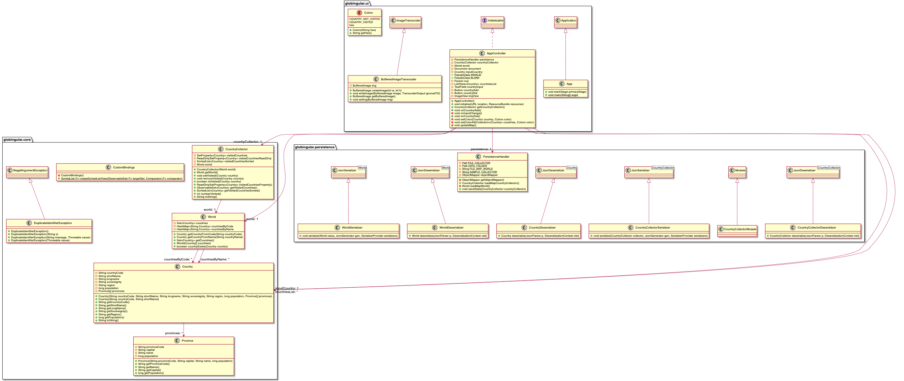
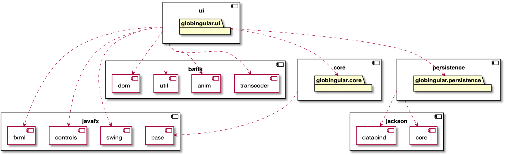
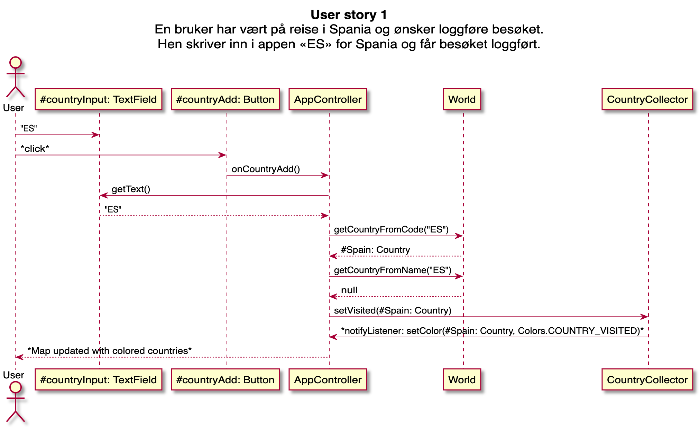

# PlantUML diagrams

**NB:** The following diagrams should render in GitLab, but as we can't get it to work they're attached as pre-rendered PNG-files.

## Classes
The following diagram shows all classes and their connections.

## Modules and dependencies
The following diagram shows the different modules and packages in this project, as well as their dependencies between each other and to external modules.

## User stories
The following diagram shows how the program will respond to a user completing *User Story 1*.

